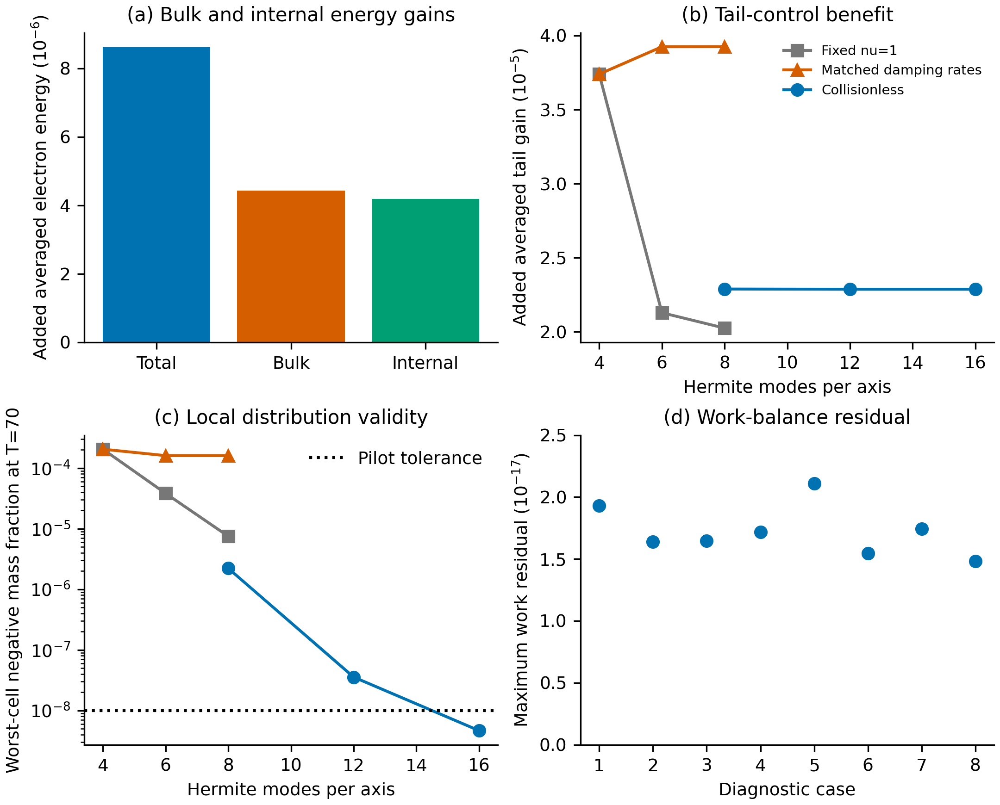

# Energization mechanism, tail validity and matched optimization

This follow-up tests the scientific gaps identified in `publication_assessment.md`.
It uses released SOLVAX0.20.0 and the same SPECTRAX RK4 equations. No alternate
collision model or custom plasma adjoint is introduced. Compressed raw mechanism
reports, hashes and a sampled-data summary are in `benchmarks/results/acceleration`.
Read a report with `json.load(gzip.open(path, 'rt'))`; the summary and figure are
regenerated by `python benchmarks/acceleration_summary.py`.

## What the original energy optimum changes

The additional [40,60] averaged electron energy is approximately51.3% bulk and
48.7% internal. These partitions use Simpson integration of saved unit-time
samples; the original RK-stage objective remains the reference for its exact
reported optimization gain. Species field work is multiplied by the normalization
used in the actual Vlasov RHS, with the same spectral mask. The electron work
budget closes within2.2e-17 across the eight diagnostic cases. This verifies
accounting, not entropy production or irreversible heating. Small CPU/GPU sampled
moments and integrated work agree within2.8e-17.

**Caption.** (a) Added averaged total, bulk and internal electron energies for the
original energy-optimized controls,16²/H4. (b) Added normalized smooth-tail gain
of those frozen controls over their baseline, using the fixed threshold5 times
initial mean thermal energy and width0.5 times that energy. All initial tails
are subtracted separately. (c) Maximum cell negative-mass fraction at T70,
measured with48³ velocity quadrature. (d) Maximum absolute electron work-budget
residual over the sampled trajectory. The H4 case uses16²; all higher-H cases use
24². Case ordering in(d) is recorded in `mechanism_summary.json`. Curves join
measured resolutions only. This is a diagnostic comparison, not a tail-optimized
acceleration result. Global negative mass can be tiny while local negative mass
is unacceptable.

## Why collision normalization matters

The implemented filter rate per velocity direction is
`nu*i*(i-1)*(i-2)/[(H-1)*(H-2)*(H-3)]`. It directly preserves density, momentum
and kinetic energy, but damps higher moments. Holding nu fixed while increasing H
changes the operator on shared modes. Thus earlier fixed-nu H4→H6 comparisons
combine filter sensitivity with numerical refinement.

Holding the shared rates fixed instead requires H4/nu1→H6/nu10→H8/nu35.
The latter two cases agree closely in the tail benefit, but converge to nonzero
local negativity: optimized T70 mean negative mass2.95439e-6 and worst-cell
fraction1.59793e-4. Increasing H does not remove this fixed-filter defect. It is
not justified to label the resulting tail an accelerated physical population.

A distinct collisionless nu0 comparison has a better validity trend. The
energy-control tail benefit changes only0.066% between H8 andH12; its q48→q96
quadrature change is around1e-5. H12 still misses the stricter local-cell1e-8
pilot tolerance at T60/T70. H16 passes at all sampled validation times:

| Time | Baseline worst-cell fraction | Energy-control worst-cell fraction |
|---|---:|---:|
| 40 | 4.02e-14 | 1.28e-13 |
| 50 | 5.52e-12 | 6.40e-12 |
| 60 | 5.57e-11 | 1.74e-10 |
| 70 | 1.56e-9 | 4.66e-9 |

These are finite-quadrature checks on sampled times, not a continuous positivity
proof. Collisionless energy transfer is not irreversible collisional heating.
The old controls were optimized for nu1 energy gain; their nu0 evaluation is a
new setting and does not constitute a nu0 tail optimization.

## Tail-control search and cost

The collisionless baseline tail gradient changes8.59e-5 relatively between
24²/H12 andH16, with dt0.05. A16²/H8/dt0.1 proposal gradient differs from the
H16 reference by2.15%, within the predeclared5% pilot gate, while one gradient
costs3.92s versus141.78s at H16. The cheaper discrete control search converges
in24 iterations, from averaged tail gain0.000152517 to0.000179408, in110.65s
excluding compilation and postprocessing. This17.63% improvement is a **coarse
candidate**, whose endpoint local-negativity check fails. Only fine-grid
re-evaluation, gradient/refinement checks and held-out-time diagnostics can
support its physical interpretation; they must be reported separately.

## Matched AD/FD optimization

The initial complete T60 comparison uses16²/H4,600steps,eight controls,seed7 and
identical L-BFGS stopping settings. Both methods converge in29 iterations/35
optimizer evaluations, with objective difference2.03e-14. AD total pipeline time
is76.90s. FD method-required accounted time is234.22s, after excluding14.88s of
AD reference compilation/execution used only for validation; full FD pipeline
time is249.11s. Warm optimization times are53.97s and196.90s respectively.
The approximately3.05× accounted total advantage is distinct from the earlier
128-control,T2,60× warm gradient benchmark. A further standalone FD run with no
AD compilation or execution removes the accounting/cache-effect caveat; its
measured result will supersede the accounted comparison for the primary figure.

All these results are reproducible numerical-control evidence. A global tail
increase or excess relative to a global Maxwellian can still reflect a mixture
of local flows, temperatures or anisotropies. Local nonthermal acceleration or
a newly identified mechanism requires additional evidence.
