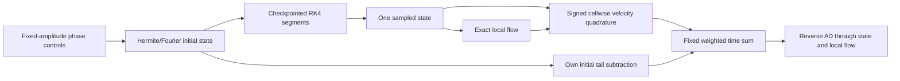

# Local flow-relative tail: implementation and validation results

The saved candidate improves the fine-grid training gain by 10.28% and the direct
held-out gain by 9.40%. Local validity checks pass at the sampled times, and
higher-quadrature gradient checks pass after retaining a q48 near-stationarity
failure. The search reached its 20-iteration cap; neither fine optimality nor
nonthermal acceleration is established. The matched local Gaussian diagnostic
is essential to this interpretation.

This extends the lab-frame result in `acceleration_results.md`. The old tail
optimum increased bulk energy while decreasing internal energy; its positive
lab-frame tail benefit therefore does not establish improved random-particle
energization. The new instantaneous observable subtracts each cell's exact bulk
velocity, differentiating both the represented distribution and that bulk velocity.
Its threshold, width and normalization remain fixed to the common initial state.

`make_local_tail_objective` is a private host factory returning a scalar JAX
callable. `Examples/2D_local_tail_control.py` composes it with the existing public
`simulation_final` API. No plasma adjoint or different time integrator is added.
Cellwise rematerialization limits velocity workspace; nested SOLVAX replay limits
retained time states. State and adjoint memory still grow with phase-space DOFs.

A cellwise tail is too expensive to insert at every RK stage without measurement.
The example instead uses a fixed normalized Simpson sum of the same smooth time
window. With 20 intervals, only 20 post-advance tail evaluations and the own-initial
term are needed, versus 2400 RK-stage evaluations in a 600-step integrand.
The window endpoints have zero weight. Both quadrature in time and velocity
must be refined; gradients are exact derivatives of this declared discrete
sampled objective, not of an assumed continuous-time integral.

## Algebra and CPU/GPU verification

31 CPU tests cover drift invariance, moment mapping, layouts, invalid densities,
and JVP/VJP/finite differences including the derivative of the local mean.
A 12²/H3, four-step rollout through T=0.2 with two sampled intervals and q16
agrees with directional centered differences to 1.98e-15 absolute error at h=1e-3.
The matched GPU run differs from CPU by 1.32e-17 in loss and 9.90e-21 in the
largest gradient component. These are plumbing checks, not resolved physics.
The rejected 8² smoke configuration had too many phase controls for its
spatial grid; it was replaced by 12² without changing the eight-control problem.

## Baseline pilots

At 16²/H8, nu=0, 600 RK4 steps and 20 sampled intervals over [40, 60], the
baseline local-tail gain is 0.000217764031 at q24 and 0.000217043085 at q48.
The change is 0.332% in gain and 0.469% in the full phase gradient. The q24
result is retained; it does not establish sufficient value convergence.
A q48 full value/gradient takes 6.39 s on the RTX A4000 (first execution after
explicit compilation). Further quadrature, sampled-time and Hermite checks are
recorded with their source-versioned reports before a search is interpreted.

The q96 gain is 0.000217069986. Relative q48→q96 changes are 1.239e-4
in gain and 1.746e-4 in the full gradient, passing the pilot tolerances. q96
first execution takes 10.20 s. Full-horizon centered directional FD agrees to
1.27e-14 absolute at step 1e-4. Doubling time intervals from 20 to 40 at q48 changes
gain by 8.58e-6 and gradient by 1.03e-5 relatively. These checks establish a usable
baseline configuration, not convergence at every possible optimized control.

At 24²/H16/1200 steps and q48 the baseline gain is 0.000217364812. The
coarse/fine relative gain difference is 0.148%, and full-gradient difference is
3.68%, within the 5% proposal gate. The fine gradient takes 151.29s. Its compiler
temporary-buffer estimate is 3.225GiB; a device snapshot during execution showed
4863MiB. Neither is a measured allocator peak. This comparison changes space,
Hermite resolution and timestep together; it validates a proposal configuration,
not isolated convergence of each discretization parameter.

The instantaneous CPU compiler-memory check uses H3 at grids 12²/24² and
q16/q32. Temporary estimates are108760/606104 bytes at 12² and 253592/702872
bytes at 24². Increasing cells fourfold at q32 changes temporaries by only 96768
bytes, rather than retaining a fourfold space-by-velocity tape. This supports
the intended workspace behavior on these points; it is not an asymptotic proof
or a measured device peak. Full raw compiler statistics and synchronized runtimes
are archived in `benchmarks/results/local-tail`.

The old lab-frame optimum, evaluated on the same16²/H8/q48 sampled problem,
has local-tail gain0.000198402266 versus baseline 0.000217043085: **8.59% lower**.
Its positive lab-frame result therefore does not transfer to this local observable.
The q48 setting was used for the cheap proposal; the final example default is
q96 following the near-stationary gradient check below. q24 remains an explicit
diagnostic option whose measured value discrepancy is retained.

## Local Gaussian diagnostic at T=50

On 24²/H16 with dt0.05, both the baseline and old lab-tail controls have
positive density/covariance and worst-cell negative mass below 5.52e-12 atT50.
At q96, baseline local-tail excess over its covariance-matched Gaussian is
−6.0632e-6; the old lab-tail control gives−3.4288e-6. Both are deficits, not
suprathermal excesses. Their q48→q96 absolute changes are2.42e-7 and 2.34e-7;
these quadrature errors must remain visible when comparing small shape residuals.
Initial excesses are approximately1.78e-8 atq96, versus−6.0e-8 atq48, exposing
quadrature error even for an initially Maxwellian representation. The primary
local tail values agree much more tightly than these subtracted residuals.
This one snapshot is mechanism-sensitive evidence, not a discovery claim.

## Bounded local-tail search

The 20-iteration q48 coarse search increases gain from 0.000217043085 to
0.000238959973 (+10.098%) in 152.18s of warm optimization. Initial integrated
energy-constraint error is exactly0 at recorded precision. The optimizer stops
at the declared iteration cap (`success=false`), not its convergence tolerance.
This is an improved candidate, not a stationary/global optimum. Fine evaluation
and validity remain separate from the successful decrease of the coarse loss.

## Fine candidate validation and energy partition

At 24²/H16/1200 steps, the saved candidate has gain0.000239710915 versus
baseline 0.000217364812: **+10.2805% of the baseline gain**, with added gain
2.23461e-5 in initial-thermal-energy units. This is only 0.002235% of initial
thermal energy. Coarse/fine added benefits differ by 1.921%, inside the 5% gate.
The fine initial integrated energies agree exactly at recorded precision.
Fine gradient norm 2.45e-7 is nonzero: no fine stationarity or global optimum claim.

The fine trajectory throughT70 passes all sampled q48 local-negativity checks;
the worst candidate cell fraction is 3.90e-9, below 1e-8. Work closure is below
1.61e-17. Saved-sample energy partition gives added total8.30e-6, bulk3.72e-6,
and **internal4.58e-6** averaged over[40, 60]. This contrasts with the old lab-tail
control's internal-energy decrease. These are sampled Simpson energy averages,
not the local-tail loss or proof of irreversible heating.


**Caption.** (a) Local-frame gain for baseline, old lab-tail control and the new
local-tail candidate on 16²/H8, q48, 600 steps. (b) Twenty-iteration coarse search;
the declared iteration cap is reached. (c) Frozen-control reevaluation on 24²/H16,
1200 steps. All use20 normalized Simpson intervals over[40, 60], fixed initial
threshold/normalization and own-initial subtraction. (d) Baseline q24/48/96
value/gradient cost on one RTX A4000, compilation excluded; the ordinate is
zoomed to expose quadrature changes. This is not an AD/FD timing comparison.
[Vector figure](figures/local_tail_control.pdf).

The new local-tail candidate atT50 has q96 local tail0.01930998750 and
matched Gaussian tail0.01931690623. Its excess is−6.91873e-6, compared with
baseline−6.06321e-6. Thus its larger local tail at this snapshot accompanies a
larger matched-Gaussian tail and a more negative shape residual. It does **not**
show a newly enhanced suprathermal excess over the local second-moment reference.
A trajectory of shape diagnostics would be required for a statement about the
whole optimization window. These results favor a methods-paper energization
claim over a particle-acceleration discovery claim in this weakly perturbed case.

## Near-stationary gradient quadrature check

At the coarse candidate, q48→q96 changes gain by only 0.0138%, but the full
gradient changes by 3.267e-9. Its q96 norm is 4.034e-9, so this fails the declared
`1e-10 + .05*norm(reference)` gate (3.017e-10). The q48 optimization result
must not be described as a quadrature-converged stationary point. Higher-order
and fine-grid gradient checks were therefore added and are reported below; the
failed q48 comparison is retained.

## Direct held-out local-frame gain

Frozen controls are evaluated on 24²/H16, 1400 RK4 steps through T70, with
40 normalized Simpson intervals over [60,70]. Both gains subtract the respective
T0 local tail. At q96, baseline gain is 0.000319641166 and candidate gain is
0.000349678092: **+9.397%**, with added gain 3.00369e-5. At q48 the benefit is
3.00251e-5, differing by 0.0394%. This is the actual local-frame objective,
not the global-tail diagnostic from the mechanism archive. This smooth weighted
held-out average differs from the earlier uniform lab-tail held-out average.
No independent time-sampling refinement of this new held-out window is claimed.

At the candidate, 20→40 training intervals change gain by 8.53e-6 relatively
and the coarse gradient by 5.65e-11 absolutely, passing the declared near-zero
gradient tolerance of 2.05e-10. The velocity-quadrature gradient issue above is
therefore distinct from observed time-sampling error.

The next q96→q128 check at the same coarse candidate passes: gradient
absolute difference 1.173e-10 is below tolerance 2.997e-10; q128 gradient norm is
3.993e-9. The q128 gain is 0.000238993187 and value/gradient cost16.63s.
Thus q96 supplies the resolved coarse-gradient check at this point, while the
q48 near-stationarity failure remains part of the evidence. The example default
uses q96; explicit q48 remains a cheaper proposal configuration.

On the fine grid at the candidate, q48→q96 changes the full gradient by
3.485e-9 (1.440%), below tolerance 1.220e-8. The q96 fine-gradient norm is
2.419e-7, and gain is 0.000239743676; value changes by 0.0137%. This passes the
fine quadrature gate without establishing fine stationarity. The reported 10.28%
improvement uses the matched q48 baseline/candidate pair, not a mixture of q48
baseline and q96 candidate values. The q96 fine value/gradient costs163.98s.

## Scientific interpretation

Removing local flow excludes instantaneous bulk drift from the kernel, but
heating, anisotropy, density weighting and transport can still change the tail.
A companion diagnostic compares it with a Gaussian matching the *local* density,
flow and full covariance. Its signed excess tests shape beyond second moments;
it is not a positive-definite distance or a unique acceleration diagnostic.
See `local_tail_plan.md` for equations, primary literature and prospective gates.

## Computational path



The matched local Gaussian is a diagnostic of the returned states, not part of
this optimized loss. Replay operates on the same fixed-step discrete RK4 solver.
The checkpoint schedule and time-sampling quadrature are separate choices.

## Reproduction

```sh
export PYTHONPATH="$PWD"
export CUDA_VISIBLE_DEVICES=0
export XLA_PYTHON_CLIENT_PREALLOCATE=false
export JAX_PLATFORMS=cuda
python Examples/2D_local_tail_control.py --quadrature 48 --evaluate-only --output results/local-tail-q48
python Examples/2D_local_tail_control.py --quadrature 48 --intervals 40 --evaluate-only --output results/local-tail-q48-i40
# Reproduce the measured cheap proposal, rather than the newer q96 default.
python Examples/2D_local_tail_control.py --quadrature 48 --iterations 20 --output results/local-tail-optimization
python Examples/2D_local_tail_control.py --grid 24 --hermite 16 --steps 1200 --quadrature 48 --controls-file results/local-tail-optimization/results.json --controls-key optimized_phase --evaluate-only --output results/local-tail-optimized-fine
python benchmarks/local_tail_holdout.py --controls-file results/local-tail-optimization/results.json --output results/local-tail-holdout
python benchmarks/local_tail_snapshot.py --controls-file results/local-tail-optimization/results.json --output results/local-tail-snapshot-optimized
```

Regenerate the figure without simulations: `python benchmarks/local_tail_panels.py`.
The 20 compressed reports and comparison summary are in `benchmarks/results/local-tail`;
source hashes identify the exact implementation for each run.

All numerical evidence in this iteration still uses released SOLVAX 0.20.0.
SOLVAX PR103 is merged at 917d1a6; switching dependencies is a separate measured
change. SPECTRAX PR42 and PR43 remain open for other collaborators to merge.

## Best subsequent physics study

Our inference from the current Gaussian deficits is to validate a reconnection
baseline before spending more optimization effort on a particle-acceleration
claim in this weakly perturbed Orszag–Tang setting. A finite guide-field case
provides explicit energization channels to diagnose: Dahlin, Drake and Swisdak
identify parallel-electric-field and curvature-drift/Fermi contributions and
show that their balance depends on guide field
([2014 primary paper](https://arxiv.org/abs/1406.0831)). Their later study finds
substantially stronger energetic-electron production in 3D than2D, associated
with access to acceleration regions rather than trapping in islands
([2015 primary paper](https://arxiv.org/abs/1503.02218)). Thus2D should be a
validated starting benchmark, not assumed to reproduce3D acceleration.

This is a proposed next study, not a SPECTRAX reproduction of either paper.
First establish a positive, resolved baseline with matching field/particle energy
budgets and local distributions in SPECTRAX's nonrelativistic representation.
Only then optimize fixed-energy controls and compare the resulting distribution
with local moment-matched references and mechanism-resolved work. The present
results already support differentiable finite-time energization; their diagnostic
limitations should remain visible instead of being recast as a nonthermal result.
