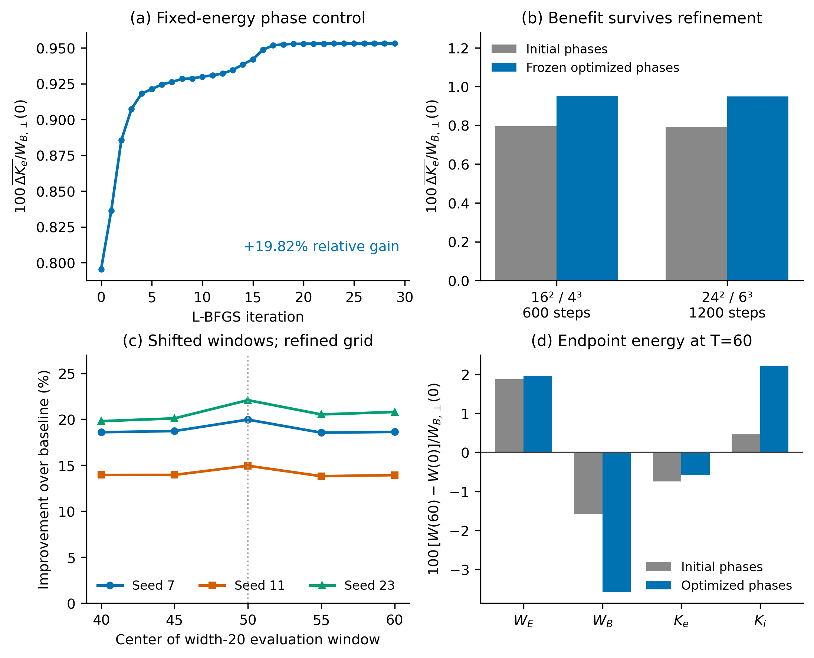
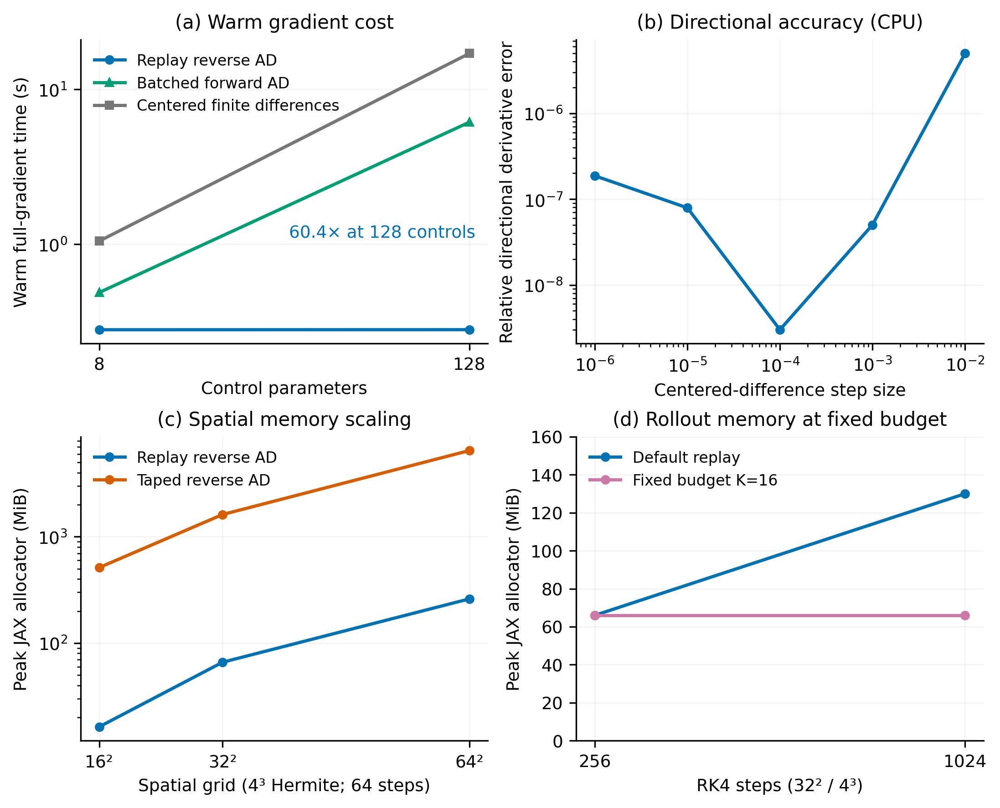

# Publication candidates and scientific readiness

The implemented methods and planned finite-time control validation are complete. A particle-acceleration or irreversible-heating claim is not complete. These two figures support a methods-paper demonstration of constrained electron energization and scalable discrete gradients. They do not establish a nonthermal population or new acceleration mechanism.

Regenerate without simulation: `python benchmarks/publication_panels.py`.

## Figure 1: constrained electron energization

[Vector PDF](figures/publication_control.pdf). Eight phase controls preserve initial magnetic/current spectra and all integrated energy channels. (a) L-BFGS maximizes the smooth weighted electron kinetic-energy gain over [40,60], normalized by initial fluctuating magnetic energy. (b) Saved coarse controls retain their benefit under combined spatial, Hermite and time refinement. (c) Three control sets, trained on [40,60], are evaluated without retraining on five overlapping width-20 windows at 24²/6³ and dt=0.05; these are not independent trials. (d) Coarse endpoint energy transfers at T=60 are shown separately from the averaged objective. Electron endpoint gain is negative even though its weighted average is positive. Initial phases versus optimized phases use identical initial integrated energies.

The coarse objective increases 0.00795482842 → 0.00953109336 (+19.815%). The refined saved-control gain is +19.9668%, and refined re-optimization reaches +19.9711%. All 30 coarse/refined seed/window cases retain positive benefit. However, the additional coarse averaged electron energy is only 0.0015763 times initial fluctuating magnetic energy, or 0.0182% of initial electron kinetic energy. The 19.8% number is relative to a small baseline gain, not to total electron energy. Energy oscillations, collision dependence, bulk versus thermal partition and velocity distributions remain scientifically important.

Provenance: `window_control_cpu.json`, `window_refined_optimization_gpu.json`, `window_shifts_refined_gpu.json`, all under `benchmarks/results`. Optimization history and endpoint bars are the saved CPU coarse run; refinement/window evaluations are GPU. The report records CPU/GPU agreement and source manifests.

## Figure 2: accuracy, speed and memory of discrete gradients

[Vector PDF](figures/publication_autodiff.pdf). (a) Warm synchronized complete-gradient medians on one RTX A4000, float64/complex128, 32²/4³, T=2, 64 steps, using the vectorized initializer and released SOLVAX 0.20.0. Only the measured control counts 8 and 128 are shown; connecting lines are visual guides. At 128 controls reverse AD takes 0.2818 s, batched forward AD 6.129 s, and serial centered differences 17.014 s (60.4× FD/reverse ratio). Compilation is excluded and reported separately in the full report; these are gradient evaluations, not measured end-to-end optimization speedups. (b) Relative directional centered-FD error against AD of the [40,60] control objective on CPU, showing the truncation/cancellation tradeoff. (c) Original source-versioned spatial scaling study: peak JAX allocator usage of replay versus taped reverse AD, with 4³ Hermite modes and 64 steps. (d) Original long-rollout study: fixed K=16 retains 66 MiB at 256 and 1024 steps; default replay reaches 130 MiB. The latter costs 4.588 s versus 6.740 s for the fixed budget at 1024 steps. Both retain states whose sizes grow with phase-space resolution.

Panels combine explicitly separate studies, not a common fresh benchmark revision: (a) `initial-vectorized/results.json`, (b) `window_control_cpu.json`, (c) `gpu_scaling_results.json`, (d) `gpu_long_rollout_results.json`. Each numerical study has source/environment provenance in the main report. Memory excludes driver/context and is not a whole-device footprint. FD uses the same solver and scalar objective; there is no cross-code or optimal batched-FD comparison. This supports superiority in the measured many-control gradient workload, not universal superiority over all nondifferentiable codes or hand-coded adjoints.

## Recommended scientific next steps, in order

1. Diagnose the saved control before a new solver project. Separate electron bulk and internal kinetic energy; reconstruct velocity distributions with quadrature and quantify negative distribution mass. Add time histories of all energy channels and species-integrated J·E, checking the exact collision operator's energy contribution. Determine whether the gain is phase timing, bulk-flow changes, or increased random energy. Existing energy conservation and small Hermite tails are insufficient to establish these distinctions.
2. If acceleration is the scientific target, predefine a smooth suprathermal energy-fraction objective relative to a fixed initial energy threshold, and report the distribution/tail rather than only its second moment. Increase Hermite resolution until that tail, objective, gradient and positivity diagnostics converge. A few low moments cannot certify a nonthermal tail. Keep initial energy constraints; test threshold sensitivity, collision sensitivity and a held-out time interval. Do not choose a threshold after seeing which one maximizes the claimed gain.
3. Benchmark matched AD and FD optimization at the actual physics horizon, with identical starts, constraints, optimizer/stopping rules and tuned FD steps. Report best objective versus total wall time, counting compilation. The existing T=2 gradient microbenchmarks and T=60 objective checks answer different questions. Check GPU occupancy and run serially; do not use the previously contended P32 inverse timings as clean speed evidence.

For a SPECTRAX software/methods paper, these figures support a defensible differentiable-control demonstration with the stated scope. For a particle-acceleration discovery paper, prioritize steps 1–2 before claiming scientific completion. More custom adjoints or an implicit solver are not the current scientific bottleneck.

## Literature positioning

Joglekar and Thomas already demonstrated optimization/discovery with differentiable kinetic simulations ([JPP 2022](https://doi.org/10.1017/S0022377822000939)); differentiable plasma optimization itself is not novel. Skene and Burns provide automated adjoints for sparse spectral PDE solvers ([2025 preprint](https://arxiv.org/abs/2506.14792)); automated spectral gradients are also established. SPECTRAX's contribution here is their practical application to its kinetic representation, constrained phase control, a small composable JVP/VJP/streamed-objective API and quantified checkpoint-memory tradeoffs. A claim of priority would require a broader novelty review.

TenBarge and Howes ([2013](https://arxiv.org/abs/1304.2958)) and Zhou, Liu and Loureiro ([2022 preprint](https://arxiv.org/abs/2208.02441)) connect kinetic current structures, collisionless damping and velocity-space transfer. These motivate mechanism-sensitive diagnostics; a Jz map or total electron kinetic-energy increase does not establish the same physics. The existing report further explains why the block-local reverse sweep in “Differentiate the Solver, Not the Equation” is not directly implemented by this global spectral RK4 replay path.
