# Publication closeout and complete figure gallery

The differentiability and constrained-energization methods demonstration is ready
for collaborator review. The original goal of demonstrating optimized nonthermal
particle acceleration remains scientifically open. Do not present the optimization
as a converged fine-grid optimum or a new acceleration mechanism.

## Results and claim boundaries

| Evidence | Result | Boundary |
| --- | --- | --- |
| Local flow-relative tail | Fine matched-q48 gain +10.28%; held-out q96 gain +9.40% | Added training gain is only 0.002235% of initial electron thermal energy; 20-iteration proposal, not fine-stationary |
| Local Gaussian diagnostic | At T50 optimized excess −6.92e−6 versus baseline −6.06e−6 | Increased tail is accompanied by increased moment-matched Gaussian tail; no enhanced nonthermal excess at this snapshot |
| Gradient validation | Full-horizon directional FD agreement; CPU/GPU parity; refined quadrature checks | Retain failed q24 baseline and q48 near-stationary checks; example now defaults to q96 |
| Full energy optimization | AD 73.48 s, FD 221.39 s: 3.01× including compilation/calibration | One matched pair, eight controls, same final objective to 2.03e−14; not a local-tail timing comparison |
| Short gradient benchmark | 60.4× FD/reverse ratio at 128 controls | T2 gradient evaluation, not full optimization or another-code comparison |
| Memory | Replay 260 MiB versus taped 6457 MiB; K16 retains 66 MiB at 256/1024 steps | Storage of time states is bounded by checkpoints; phase-space state/workspace still grows with DOFs |

The original fixed-nu Hermite comparison changes shared-mode damping and is not
pure fixed-operator convergence. The later collisionless tail study is separate.
Local negative-mass checks concern sampled quadrature nodes and times; they do
not certify continuous positivity. Compiler memory estimates are not allocator
peak measurements. All reported runs retain released SOLVAX 0.20.0 provenance.

## Review and reproduction

Read [local-tail results](local_tail_results.md), [acceleration results](acceleration_results.md),
[handoff](acceleration_handoff.md), and [original assessment](publication_assessment.md)
for numerical settings, controls, source hashes, failed gates and reproduction commands.
The final archive audit validated 20 local-tail and 29 acceleration report checksums
and parsed every archived JSON. Python 3.11/3.12 and patch-coverage checks passed
on numerical implementation commit `6904b13654460c0d25cfd8845262ff5e58e3b319`.
This closeout adds documentation and a PNG rendered from the existing spectrum PDF;
it does not change numerical source or results.

Recommended current manuscript pair: **local_tail_control** for the most carefully
qualified physics control result and **publication_autodiff** for gradient accuracy,
speed and memory. Include **optimization_comparison_gpu** alongside the latter
when claiming measured end-to-end speedup. Original energy-control panels and all
supporting plots are retained below, with vector PDFs for typesetting.

SOLVAX PR103 is merged at `917d1a679d8258bb7c9929e2320f4befbbe92f93`.
SPECTRAX PR42 and PR43 remain open; only other collaborators may merge them.
PR43 is stacked on PR42, so review the incremental changes with that dependency
in mind. No numerical dependency upgrade is implied by the SOLVAX merge.

## Next physics study

[Reconnection follow-up](reconnection_followup.md) defines the next baseline and
acceptance gates. It is future work, not an implemented or validated reconnection
result. Further OT optimizer iterations have lower scientific value than establishing
a resolved baseline capable of producing the intended acceleration signal.

## Complete figure gallery

Historical/supporting plots retain their original numerical settings; their results
must not be combined into a single timing or convergence experiment. Full captions
and provenance are in the linked assessments above.

### local tail control

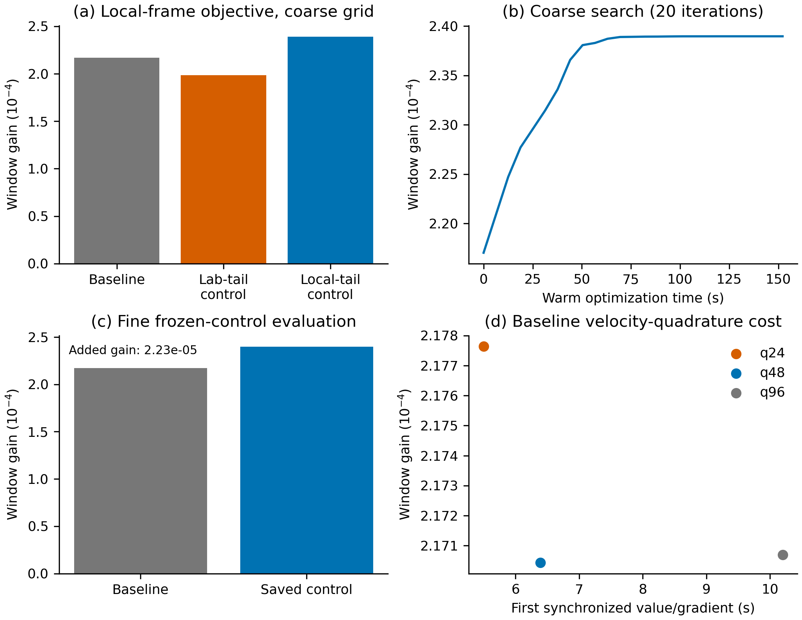

[Vector PDF](figures/local_tail_control.pdf).

### publication autodiff

[Vector PDF](figures/publication_autodiff.pdf).

### optimization comparison gpu

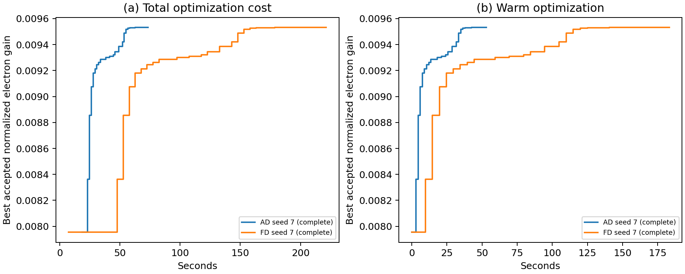

[Vector PDF](figures/optimization_comparison_gpu.pdf).

### publication control

[Vector PDF](figures/publication_control.pdf).

### energization mechanism comparison

[Vector PDF](figures/energization_mechanism_comparison.pdf).

### tail control

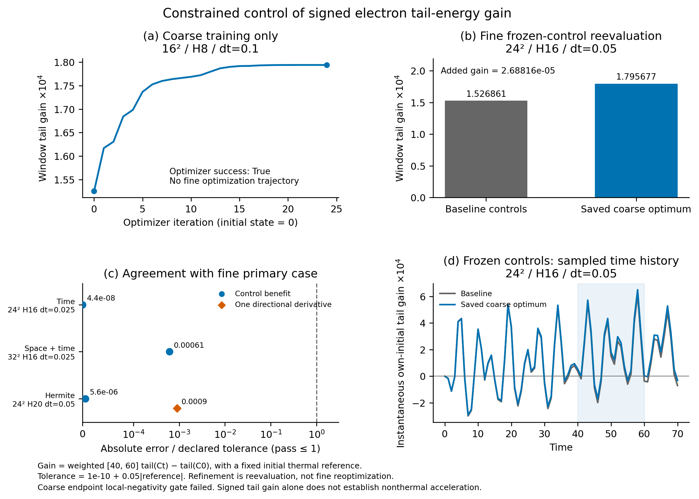

[Vector PDF](figures/tail_control.pdf).

### tail spectrum optimized

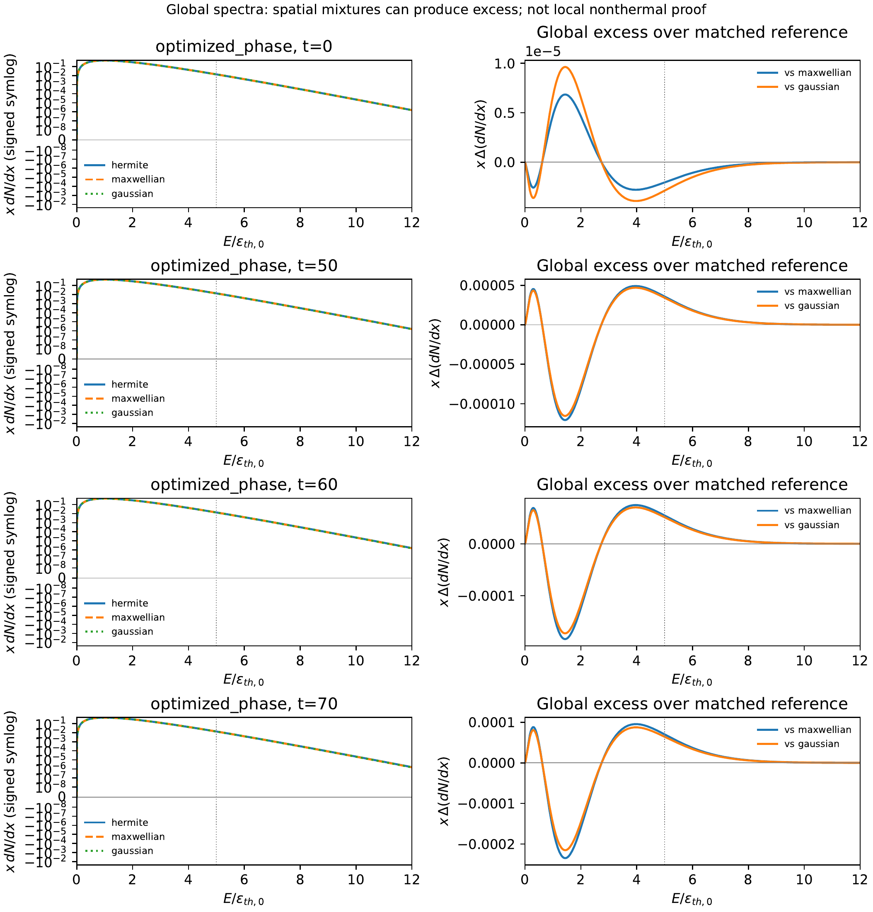

[Vector PDF](figures/tail_spectrum_optimized.pdf).

### current inverse gpu

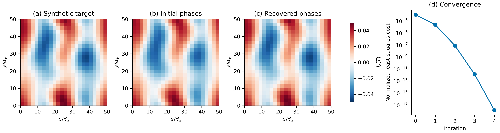

[Vector PDF](figures/current_inverse_gpu.pdf).

### gradient scaling

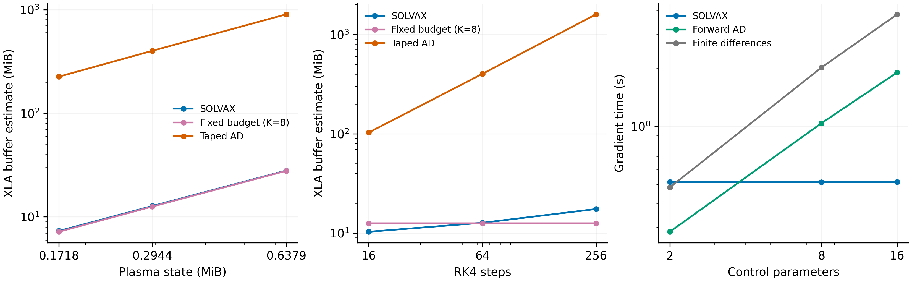

[Vector PDF](figures/gradient_scaling.pdf).

### gradient scaling gpu

[Vector PDF](figures/gradient_scaling_gpu.pdf).

### gradient validation

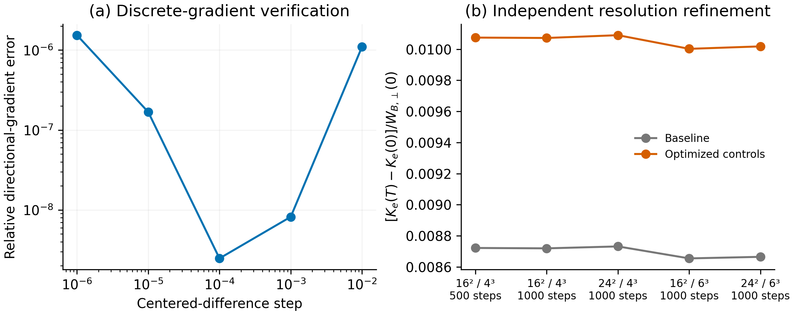

[Vector PDF](figures/gradient_validation.pdf).

### long rollout gpu

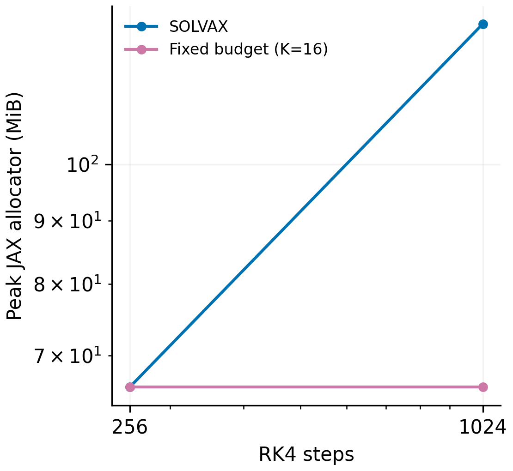

[Vector PDF](figures/long_rollout_gpu.pdf).

### phase control

[Vector PDF](figures/phase_control.pdf).

### window phase control

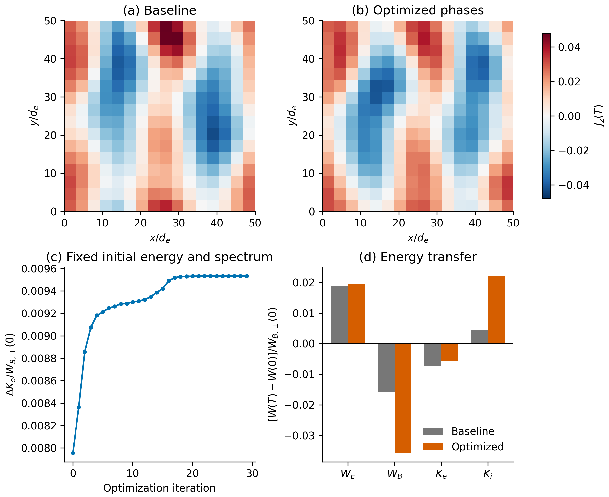

[Vector PDF](figures/window_phase_control.pdf).

### window robustness gpu

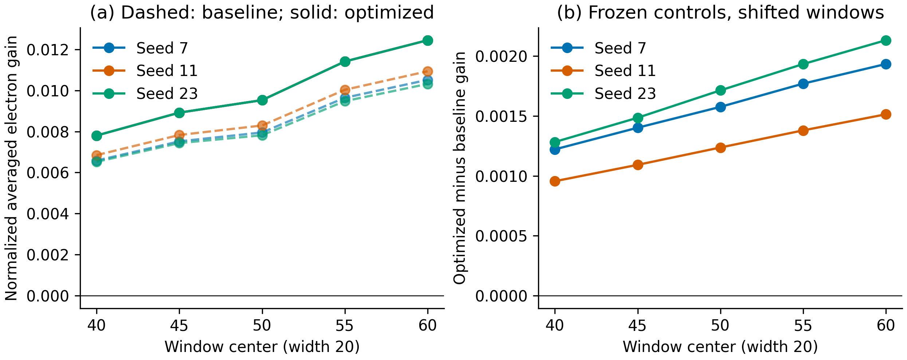

[Vector PDF](figures/window_robustness_gpu.pdf).

### window robustness refined gpu

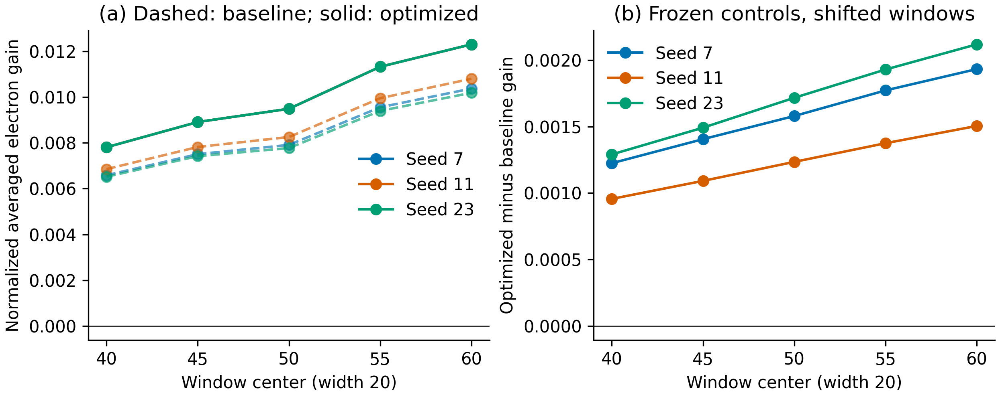

[Vector PDF](figures/window_robustness_refined_gpu.pdf).

### window validation gpu

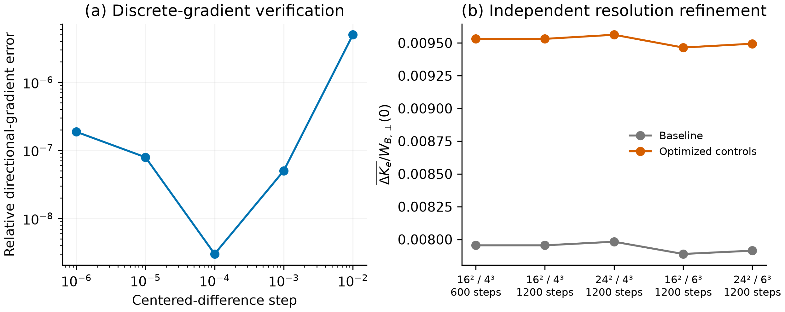

[Vector PDF](figures/window_validation_gpu.pdf).

