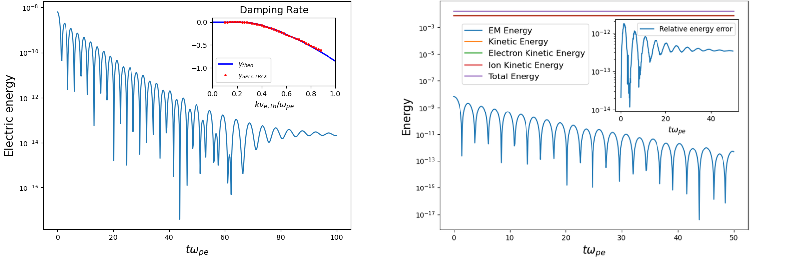
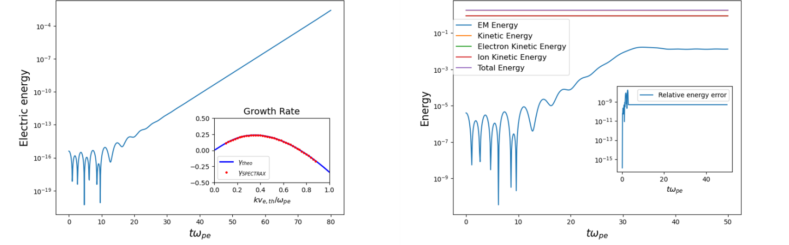
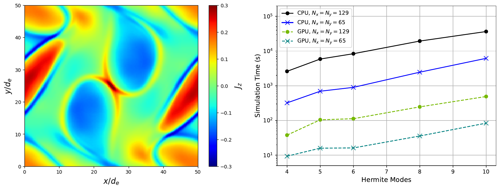

# Summary

Resolving the multiple scales of weakly collisional plasmas poses a computational challenge. One possible approach is to perform a spectral decomposition of the one-particle probability density function and the electric and magnetic fields, and keep only the modes needed to model the physics of interest. SPECTRAX is a high-performance, open-source Vlasov-Maxwell solver that models the dynamics of collisionless plasmas by time-evolving the Hermite-Fourier moments of the one-particle probability density function and the fields. It is written in pure Python and leverages the JAX library for just-in-time compilation, automatic parallelization, and execution on hardware accelerators. Time integration is performed using the Diffrax library, which provides high-order, adaptive, and efficient time-stepping of the resulting system of ordinary differential equations.

# State of the field

Turbulence down to kinetic scales is ubiquitous in the weakly collisional plasmas found in space, astrophysical, and laboratory environments, but resolving all relevant scales poses a significant computational challenge (see, e.g., [@Schekochihin2009; @Barnes2010; @Verscharen2019]). A well known approach to kinetic plasma simulations is to perform a spectral decomposition of the one-particle probability density function (PDF) and the electric and magnetic fields, and time evolve only the modes needed to model the physics of interest while discarding the others [@Mandell2024; @Roytershteyn2018; @Koshkarov2021]. When the one-particle PDF is close to a Maxwellian distribution, it is appropriate to expand functions of the particle velocity into a truncated asymmetrically weighted Hermite basis, with the first three moments corresponding to a fluid model and subsequent moments adding kinetic corrections to it [@Delzanno2015]. This method is known to conserve particle number, linear momentum, and energy, and has been successfully implemented in the (Fortran-based) code Spectral Plasma Solver (SPS) [@Delzanno2015; @Vencels2016; @Roytershteyn2018], in which functions of the configuration space coordinates are decomposed into Fourier modes, and in the more recent SPS-DG [@Koshkarov2021], which instead employs a discontinuous Galerkin discretization in configuration space. However, SPS and SPS-DG are not available as open-source software, limiting their accessibility, extensibility, and use in the broader research and educational community. With SPECTRAX we aim to fill this gap. It implements a Hermite–Fourier spectral approach for Vlasov–Maxwell simulations within a modern, open-source, Python-based framework, lowering the barrier for researchers to use, modify, and contribute to spectral kinetic plasma simulations.

# Software design

By leveraging the JAX library [@Bradbury2018] for just-in-time (JIT) compilation, SPECTRAX offers performance competitive with compiled languages while retaining the simplicity of Python. The nonlinear terms in the ODE system are computed using a standard pseudo-spectral approach [@Patterson1971], in which a 2/3 de-aliasing mask is applied to the Hermite–Fourier coefficients of the distribution functions and fields, followed by a fast Fourier anti-transform, multiplication in real space, and a fast Fourier transforms back to spectral space. The operation is performed on all nonlinear terms simultaneously. All equations for the particle PDF moments for all plasma species are assembled simultaneously using JAX array operations, allowing the ODE system to be evaluated efficiently in a single call. The equations for the fields are assembled separately. The ODE system is integrated in time using JAX-based library Diffrax [@Kidger2021]. The efficient handling of the nonlinear terms and the evaluation of the ODE system enables SPECTRAX to achieve high performance on a single CPU or GPU.

# Research impact statement

SPECTRAX can simulate the time evolution of the full, self-consistent Vlasov-Maxwell system for two or more plasma species. Since functions of space coordinates are decomposed into Fourier modes, simulations naturally assume periodic boundary conditions in all spatial directions. The code has been verified against several standard kinetic plasma physics benchmarks, including (1) 1D linear Landau damping, (2) 1D two-stream instability, and (3) 2D Orszag-Tang vortex. Regarding (1) and (2), the measured damping and growth rates are observed to closely match the analytical predictions (\autoref{fig:landau} and \autoref{fig:twostream}, left panel). Regarding (3), SPECTRAX reproduces the out-of-plane current density reported in [@Vencels2016] (compare their Figure 1 to the left panel of \autoref{fig:orszag} here). Time stepping was performed with Diffrax's implementation of the Dormand-Prince 8/7 method. While we note that exact energy conservation is not expected from this method, excellent energy conservation was observed in these benchmarks (see \autoref{fig:landau} and \autoref{fig:twostream}, right panel). The Orszag-Tang benchmark was also used to assess the computational performance of SPECTRAX on CPUs and GPUs. The use of a GPU consistently yields speedups of almost two orders of magnitude relative to a CPU (see \autoref{fig:orszag}, right panel). In addition, as shown in \autoref{tbl:compiletime}, the compilation overhead remains between 5 and 12 seconds across all tested configurations, and is not seen to scale with size.

| Hermite modes | 4 | 5 | 6 | 8 | 10 |
|---|---:|---:|---:|---:|---:|
| Wall-clock time (incl. compilation) (s) | 42 | 105 | 119 | 247 | 492 |
| Wall-clock time (excl. compilation) (s) | 33 | 100 | 107 | 242 | 486 |
| Compilation overhead (s) | 9 | 5 | 12 | 5 | 6 |

Table: Comparison of Orszag–Tang simulation runtime on GPU, with and without compilation time. The same number of Hermite modes was used in all three dimensions of velocity space. \label{tbl:compiletime}

# AI usage disclosure

GPT versions 3.5, 4o, 5, and 5.2 were used in generating code and the corresponding documentation. Corrections and improvements to the code were implemented by the authors with AI assistance. GPT version 5.2 assisted in the drafting of this manuscript. All AI generated code and text was reviewed (and frequently modified) by the authors.

# Acknowledgements

This work was supported by the National Science Foundation under Grants No. PHY-2409066 and PHY-2409316. This research used resources of the National Energy Research Scientific Computing Center, a DOE Office of Science User Facility supported by the Office of Science of the U.S. Department of Energy under Contract No. DE-AC02-05CH11231 using NERSC award NERSC DDR-ERCAP0030134.
